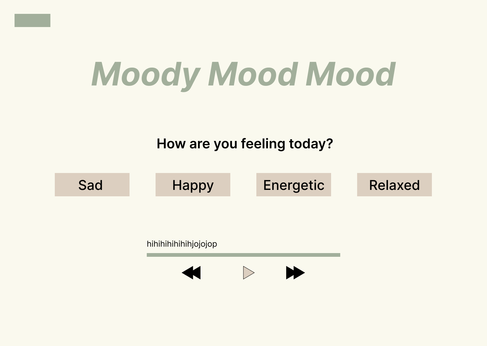

# Moodie Mood Mood
A fun interactive website where users can select a mood, and the theme and music change accordingly.

# What I've learned
This project was built to apply the JS knowledge I have learned so far. Here is what I have implemented:
- Modern JavaScript practices
- Use of querySelector instead of getElementById
- Switch statements
- Dynamic theme changes based on user mood
- Audio control with progress bar interaction
- Responsive layout for all screen sizes

# Features

- Mood-based song playback
- Two unique songs for each mood    
- Dynamic background changes based on mood

# Figma Prototype

# Tech Stack

- HTML5
- CSS3
- JavaScript

# Clone the repo
git clone https://github.com/ayisha33mannan/ayisha33mannan.github.io.git

# Credits
 
- Songs sourced from pixabay.com
- Color palettes selected from colorhunt.co
- Icons from fontawesome.com

# Author
Ayisha Mannan
# Website Link
https://ayisha33mannan.github.io/moodie/   
